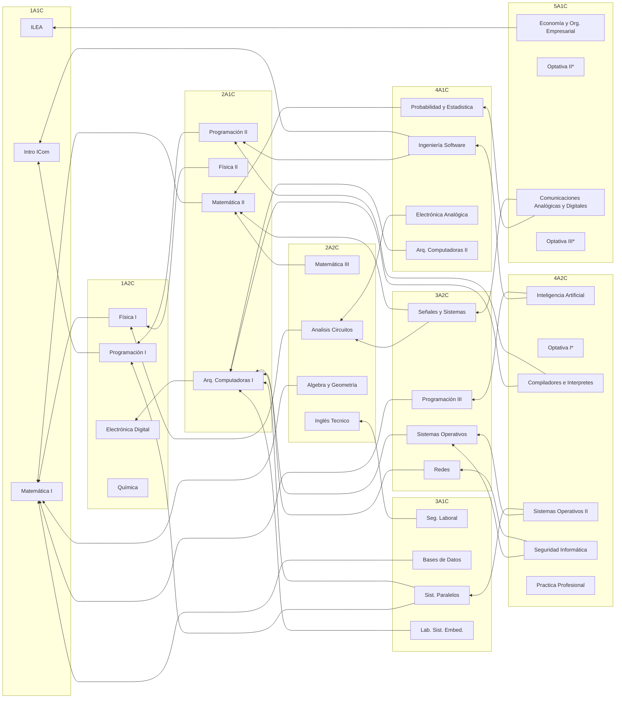

## ¡Hola!

Aqui trataremos de reunir toda la información acerca de la carrera Ingeniería
en Computación de la Universidad Nacional de Rio Negro ubicada en la Sede 
Andina de San Carlos de Bariloche.

## ¿Que es la carrera?

### Objetivos

 * Desarrollar las habilidades propias de un Ingeniero de primer nivel
 * Desarrollar software sobre hardware propio
 * Procesamiento de datos y señales
 * Construir bases de datos
 * Trabajar sobre todas las etapas de un proyecto de Software
 * Trabajar en equipo con especialistas de diversa formación
 * Hacer peritajes informáticos
 
### ¿Cómo es la carrera?

En tres años, podes acceder al titulo intermedio de Técnico en Computación
y en dos años mas, al titulo de Ingeniero en Computación

### ¿Qué información hay acá?

Por ahora, enlaces a los calendarios de las materias en un formato que es
posible incorporar a telefonos que puedan emplear el formato iCal.

[UNRN - Ingeniería en Computación](https://www.unrn.edu.ar/carreras/Ingenieria-en-Computacion-78)

Calendario [General](https://calendar.google.com/calendar/embed?src=c_42sm1h4p62g11qkhlglcsmegro%40group.calendar.google.com&ctz=America%2FArgentina%2FBuenos_Aires)

### Correlativas

